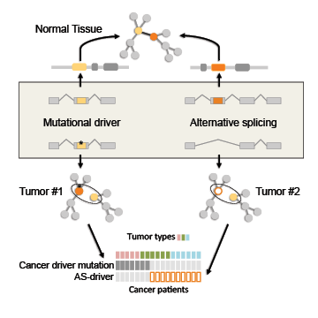

We studied the functional impact of alternative splicing alterations in cancer, with special interest on their potential as tumor drivers. The article is available in [Cell Reports](http://www.cell.com/cell-reports/abstract/S2211-1247(17)31104-X).

# Analyses

## Manuscript figures and tables

* [Manuscript figures](switches/figures.ipynb)
* [Manuscript supplementary figures](switches/sup_figures.ipynb)
* [Manuscript supplementary files](switches/sup_files.ipynb)

## Switches

* [Switch statistics](switches/switches_stats.ipynb)
* [Immune cells/stroma contamination](switches/immune_analysis.ipynb)
* [Functionality](switches/functionals.ipynb)
* [Tumorigenic evidences](switches/potus.ipynb)
* [Events involved](switches/splicing_events.ipynb)
* [PSI study](switches/psi_study.ipynb)

## Mutations

* [Whole-exome sequencing gene analysis](mutations/wes_genes.ipynb)
* [Whole-genome sequencing gene analysis](mutations/wgs_genes.ipynb)
* [CNA analysis](mutations/cna.ipynb)
* [Mutual exclusion: comet](mutations/me_comet.ipynb)

## Structure

* [Pfam domains](structural_analysis/pfam_switches.ipynb)
* [Protein-protein interactions](structural_analysis/ppi.ipynb)
* [Protein-protein interactions stats](structural_analysis/ppi_stats.ipynb)
* [Protein-protein interactions mutual exclusion](structural_analysis/ppi_me.ipynb)
* [Protein-protein interactions neighborhoods](structural_analysis/ppi_neighborhoods.ipynb)
* [Neighborhood curation](structural_analysis/ppi_interesting_neighborhoods.ipynb)

# Data

The data was generated by applying the [spada](https://github.com/hclimente/spada) and [scudo](https://github.com/hclimente/scudo) pipelines to transcript expression data generated by the TCGA project. The files necessary to replicate all these analyses are available [here](https://zenodo.org/record/824637); it must be placed in a `data/` folder inside the project.

# Dependencies

This Jupyter notebook requires the following external libraries to function:

* [find.me](https://github.com/hclimente/find.me)
* [ggstars](https://github.com/hclimente/ggstars)
* [tidyverse](https://github.com/tidyverse/tidyverse)
* [magrittr](https://cran.r-project.org/web/packages/magrittr/index.html)
* [UpSetR](https://github.com/hms-dbmi/UpSetR)
* [cowplot](https://github.com/wilkelab/cowplot)
* [network](https://cran.r-project.org/web/packages/network/index.html)
* [ggnetwork](https://github.com/briatte/ggnetwork)
* [igraph](http://igraph.org/r/)
* [intergraph](https://cran.r-project.org/web/packages/intergraph/index.html)
